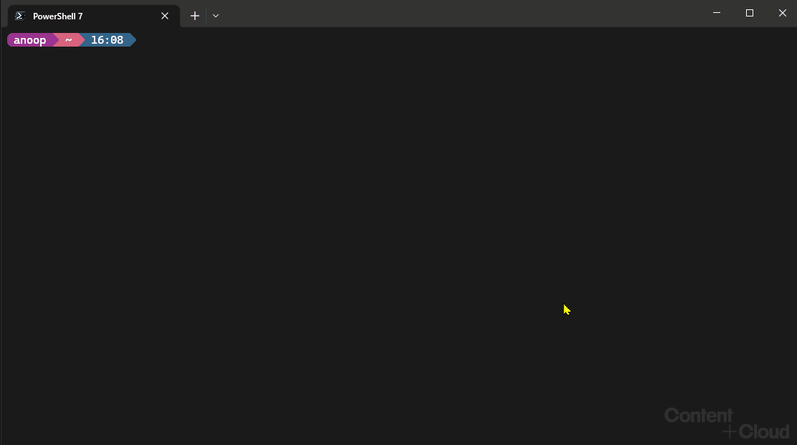

# Power Platform CLI PowerShell Predictor module

## Overview

[Power Platform CLI PowerShell Predictor](https://www.powershellgallery.com/packages/PPCLI.PowerShell.Predictor) is a PowerShell
module that helps you navigate the cmdlets and parameters of
[Power Platform CLI](https://learn.microsoft.com/en-us/power-platform/developer/cli/introduction) in PowerShell. It provides suggestions for command completion when using Power Platform CLI cmdlets in PowerShell.

Power Platform CLI PowerShell Predictor uses the
[subsystem plugin model](/powershell/scripting/learn/experimental-features#pssubsystempluginmodel)
available in PowerShell 7.2. This updated version requires
[PSReadLine 2.2.2](https://www.powershellgallery.com/packages/PSReadLine/2.2.2) or higher to display
suggestions.



## Requirements

Required configuration for SPO PowerShell Predictor:

- [PowerShell 7.2](https://github.com/PowerShell/PowerShell/) or higher
- [PSReadline 2.2.2](https://github.com/PowerShell/PSReadLine/) or higher

Install the latest version of PSReadLine:

```powershell
Install-Module -Name PSReadline
```

#### Set preferred source and view for suggestions

Enable predictions from history and plugins

```powershell
Set-PSReadLineOption -PredictionSource HistoryAndPlugin
```

Enable list view:

```powershell
Set-PSReadLineOption -PredictionViewStyle ListView
```

## Getting started

### Install Power Platform CLI PowerShell Predictor

To install the PPCLI.PowerShell.Predictor PowerShell module run the following

```powershell
Install-Module -Name PPCLI.PowerShell.Predictor
```

### Import Power Platform CLI PowerShell Predictor

To import the Power Platform CLI PowerShell Predictor PowerShell module in the current session run the following

```powershell
Import-Module -Name PPCLI.PowerShell.Predictor
```

### Use Power Platform CLI PowerShell Predictor

Once imported, start typing Power Platform CLI cmdlet (e.g. `pac admin...`) and see the predictions loading.

## Uninstallation

Once installed and enabled, Power Platform CLI PowerShell Predictor is loaded in the PowerShell profile.
To uninstall the PPCLI.PowerShell.Predictor module:

1. Close **all** PowerShell sessions including VS Code.

1. Launch a PowerShell session with no profile.

   ```powershell
   pwsh -noprofile
   ```

1. Uninstall Power Platform CLI PowerShell Predictor

   ```powershell
   Uninstall-Module -Name PPCLI.PowerShell.Predictor -Force
   ```

1. Close PowerShell